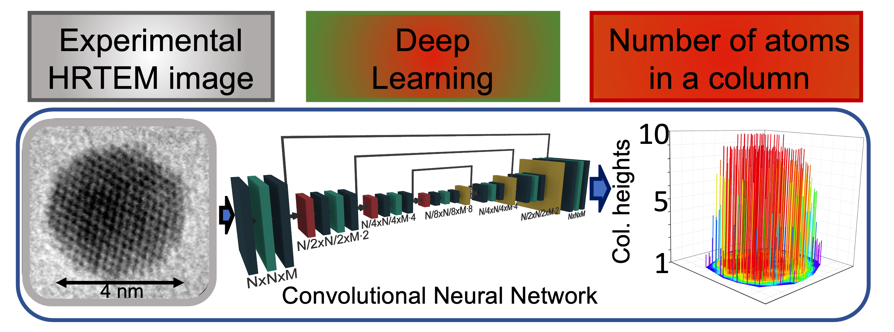

# Deep-Learning-HRTEM-Images-Gold-Nanoparticles


This repository contains the codes to implement a Deep Learning framework to predict the 3D structure of gold nanoparticles represented in a 2D view in High-Resolution Transmission Electron Microscopy (HRTEM) images. The codes provided in this repository have been developed as part of a project about Computer Vision and Deep Learning applied to microscopy images of advanced materials at the University of Illinois at Chicago. The results illustrated in this repository have contributed to the paper "Atomic column heights detection in metallic nanoparticles using deep convolutional learning" published in the Computational Materials Science journal in 2020. 

If you are intended to use our code, please cite:

***Ragone M.***, *Yurkiv V., Song B., Ramasubramanian A., Shabazian-Yassar R., Mashayek F., Atomic column heights detection in metallic nanoparticles using deep convolutional learning, Computational Materials Science,180, (2020) 109722*




# How to use it 

## 1. Installation

**Python Installation**: 

Install Python 3.7 in Anaconda:

https://www.anaconda.com/


**Required Pyton Packages**:

**Atomic Simulation Environment, PyQSTEM, tqdm, natsort, cython**:

```yaml
conda install -c conda-forge ase pyqstem tqdm natsort cython
```

The Deep Learning models are built in both Tensorflow 2.2.0 and PyTorch. The codes are avaiolable in the folder **tf2.2** and **pytorch**. Please install the package you wish to use.

**Tensorflow 2.2.0**:

```yaml
pip3 install tensorflow==2.2.0
```
**PyTorch**:

```yaml
conda install -c pytorch pytorch torchvision
```
Both Tensorflow 2.2.0 and Pytorch contain a script for model parallelization using the library *Horovod* (https://github.com/horovod/horovod). Please refer to the linked GitHub repository for installing Horovod.

**Scikit-Lean**:

```yaml
conda install -c conda-forge scikit-learn 
```

**Scikit-Image**:

```yaml
conda install scikit-image 
```

## 2. Python codes
### 2.1 Images Simulation

The Python script to run for simulating HRTEM images and the corresponding CHs label maps are *make_NPs_data.py* or its parallelized version (much more efficient!) *make_NPs_data_multiprocessing.py*. The scripts *make_NPs_data_utils* and *make_NPs_statistics.py* are used as dependencies. The scripts generate the folders which contain the training data (simulated HRTEM image and CHs label maps). The jupyter-notebook *visualize_NPs_data.ipynb* illustrates how the code works step-by-step, providing the explaination for each line. Please run:

```yaml
python make_NPs_data_multiprocessing.py
```

### 2.2 Deep Learning with GPUs parallelization
The folders tf2.2 and pytorch contain the deep learning scripts to run the training and test of the fully convolutional network (FCN). You can choose to use Tensorflow or PyTorch, depending on your preference. In both cases the scripts work with the simualted data saved in the folders **training_data** and **test_data**. Training and test are performed simultaneously. 

The codes are implemented with **GPUs distribution** using **data parallelization** and **model parallelization**. The models also benefit of the *mixed precsion* technique (https://docs.nvidia.com/deeplearning/performance/mixed-precision-training/index.html) Mixed precision allows to accelerate the training of DL models on GPUs with computing capability >= 7.0. The tensorflow implementation also benefits of the Accelerated Linear Algebra (XLA) (https://www.tensorflow.org/xla). Both Tensorflow and Pytorch have been implemented using custom training implentation.

**2.2.1 Tensorflow**: the scripts are located in the folder tf2.2. There are three different implentation of the training/validation:

1) *training_data_parallelization.py*: distributed training implemented with data parallelization technique. Please run:

```yaml
python training_data_parallelization.py
```
2) *training_model_parallelization.py*: distributed training implemented with model parallelization technique (Horovod). Using 4 GPUs, please run:
```yaml
horovodrun -np 4 -H localhost:4 python training_model_parallelization.py
```
3) *training_default.py*: default implementation, with no data distribution. Please run:
```yaml
python training_default.py
```
The code generates two folders **training_results** and **test_results**. 

**training_results** contain three subfolders: 

1) **training_learning_curve**: this folder contains two numpy arrays where the training loss and R2 learning curves are stored.
2) **weights**: this folder contains the weights saved over the epochs during the training of the FCN.
3) **debug**: this folder contains the images and labels loaded in each batch. In this way you can check what it is actually going through the network and be sure that everthing works as expected.

**test_results** contain the subfolder: 
1) **test_learning_curve**: this folder contains two numpy arrays where the test loss and R2 learning curves are stored.

The scripts *fcn.py* and *training_utils.py* are used as dependencies. *fcn.py* contains the implementation of the DL model, which is an FCN, while *training_utils.py* contains classes to implement data augmentation and calculation of the R2 score between the predicted and the true CHs for evaluation of the model's performance. 

The jupyter-notebook *visualize_training_data-parallelization.ipynb* illustrates how the code works step-by-step, providing the explaination for each line. 


**2.2.2 Pytorch**: the scripts are located in the folder pytorch. Similarly to Tensorflow, there are scripts for distributed and default implementations. The framework is equivalent to Tensorflow implementation. The difference in the code is just the PyTorch style.

### 2.3 Application of the trainde Deep Learning model to experimental HRTEM image
Once the model has achieved a satisfactory performance in the training and test process, it can be applied to predict the atomic CHs of nanoparticles in experimental HRTEM images with high reliability!

